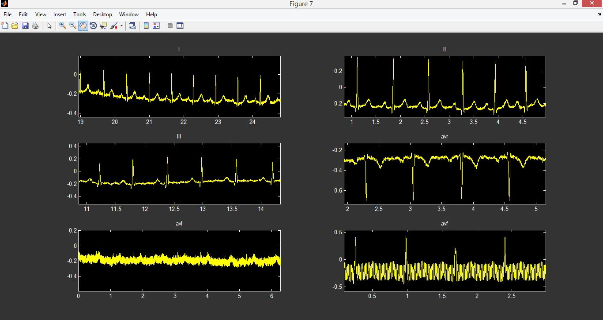
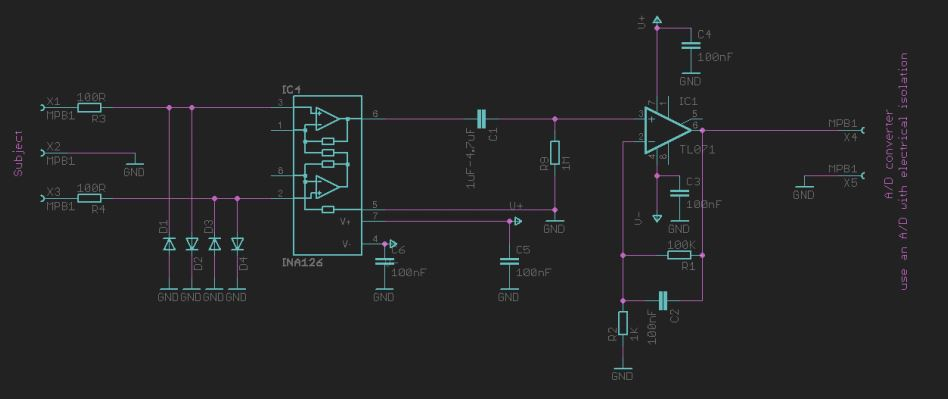
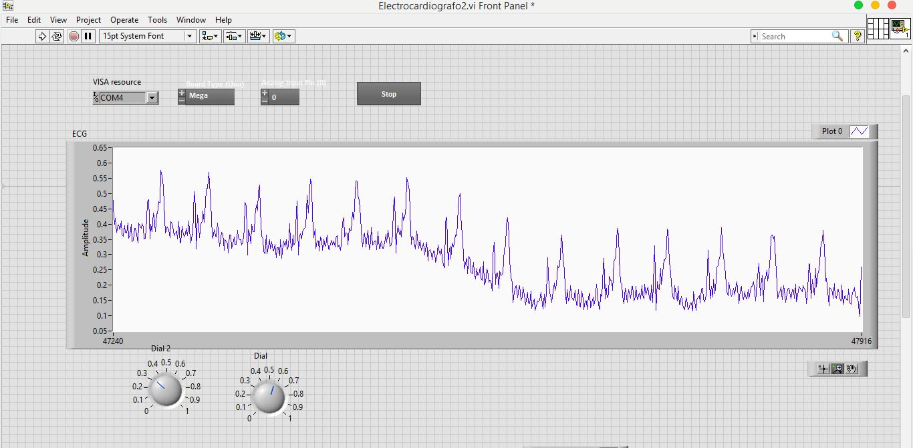
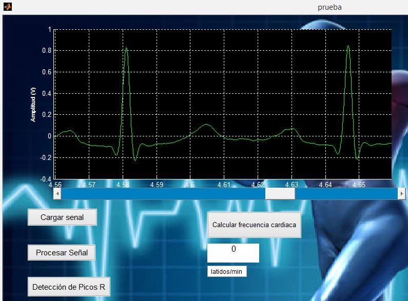

# Electrocardiogram (ECG) Circuit

  
  

 

## Skills and tools used

> Circuit Design | LabVIEW | MATLAB | Digital Signal Processing | Arduino
                                                                                                                
## Summary

his project involves the design and implementation of an electrocardiogram (ECG) circuit. The ECG signal initially goes through an amplification process and it is then filtered using a high-pass filter. At first, the circuit is directly connected to an oscilloscope. The oscilloscope it is then replace by an Arduino Mega microcontroller board and the signal is passed to LabVIEW and MATLAB for digital signal analysis and filtering. A graphical user interface (GUI) is implemented in MATLAB that provides peak detection and heart rate calculation.

  
  
  
  

 
